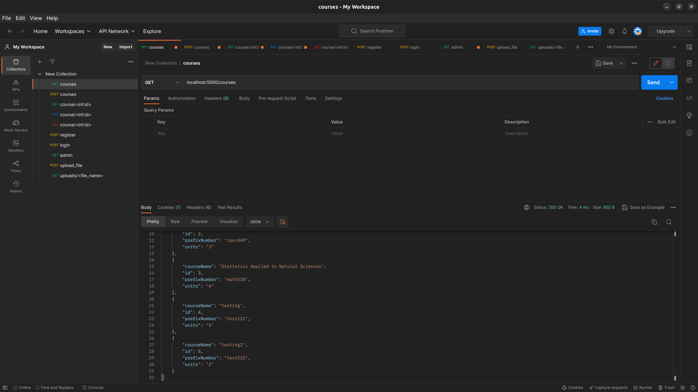

# Set Up

```shell
git clone https://github.com/dscatalan/449-api.git
cd 449-api/
```

create `.env` file in project root directory 

copy and paste the following into `.env` file

```
MYSQL_USER="?"

MYSQL_PASSWORD="?"

MYSQL_DB="?"

JWT_SECRET_KEY="?"
```

Edit `?` with your credentials


create the environment in project root directory 
```shell
python3 -m venv venv
```


activate the environment in project root directory 
```shell
. venv/bin/activate
```


Install the required packages (in activated environment)
```shell
pip install -r requirements.txt
```


# Run (in activated environment)
```shell
flask run
```

# Postman 




# Info
Team 17: Daisy Catalan

Using
- Ubuntu 22.04
- MySQL Workbench
- Postman

## Resources
 - [Flask's Documentation](https://flask.palletsprojects.com/en/2.2.x/)
 - [Build a Rest API using Flask - P4- Python Flask tutorials](https://www.youtube.com/watch?v=8L_otSDvmR0)
 - [User Authentication in Flask App using JWT [ JSON Web Token ]](https://www.youtube.com/watch?v=_3NKBHYcpyg)
 - [Flask-Admin - An Example With an Existing Data Model](https://www.youtube.com/watch?v=0cySORIhkCg)
 - [Build a JWT Based Authentication REST API with Flask and MySQL](https://medium.com/@karthikeyan.ranasthala/build-a-jwt-based-authentication-rest-api-with-flask-and-mysql-5dc6d3d1cb82)
 - [Flask Docs: File Uploads](https://flask.palletsprojects.com/en/2.2.x/patterns/fileuploads/)
